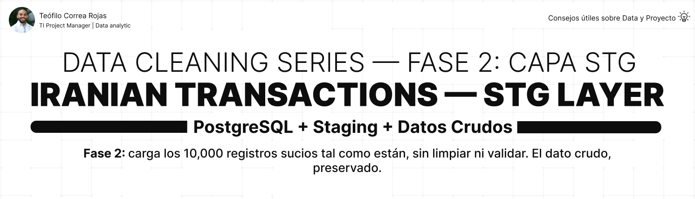

# Iranian Transactions — STG Layer



## 📌 Descripción

Segunda fase de una serie de limpieza de datos en PostgreSQL usando el
**Dirty Iranian Transactions Dataset** (Kaggle). Este proyecto crea la
tabla de staging y carga los 10,000 registros tal como llegan del CSV:
sucios, inconsistentes y sin validar.

La capa STG no limpia ni corrige. Su único rol es **preservar el dato
original** como punto de partida trazable para todo el proceso.

> ℹ️ Dataset sintético de práctica de Kaggle, usado con fines educativos.

---

## 🎯 Objetivos del proyecto

- Diseñar la tabla STG con todo en TEXT y sin constraints
- Cargar los 10,000 registros sucios sin modificarlos
- Validar que la carga fue completa (COUNT = 10,000)
- Preservar el dato original como respaldo trazable

---

## 🏗️ Contexto — Arquitectura Medallion

```
iranian_transactions_db
│
├── stg ← este proyecto ⭐ (datos crudos)
├── bronze → auditoría
├── silver → limpieza
└── gold → modelo dimensional
```

STG es la entrada del pipeline. Los datos llegan aquí tal como
están en el CSV — con todas sus inconsistencias — y se preservan
intactos para que cualquier capa posterior pueda trazarlos.

---

## 📋 Sobre la tabla

```
stg.transactions
→ 6 columnas, todas TEXT
→ sin PK, sin constraints
→ 10,000 registros
```


| Campo | Tipo | Descripción |
|---|---|---|
| `status` | TEXT | Estado de la transacción (sucio: fail/FAIL/failed...) |
| `transaction_time` | TEXT | Fecha y hora |
| `card_type` | TEXT | Tipo de tarjeta (sucio: MastCard, Vsa...) |
| `city` | TEXT | Ciudad (sucio: TEHRAN, tehr@n, nan...) |
| `amount` | TEXT | Monto (sucio: -999999, 0, negativos...) |
| `id` | TEXT | Identificador |

---

## 💡 Decisiones clave de esta capa

| Decisión | Razón |
|---|---|
| Todo TEXT | Los datos llegan sucios; tipos estrictos rechazarían valores como "-999999.0" o "nan" |
| Sin PK | El id se repite en el dataset (rango 1-100); una PK fallaría |
| Sin constraints | STG acepta todo; la validación ocurre en Silver |
| Datos intactos | Preservar el original permite trazar cualquier transformación futura |

---

## ✅ Resultado de la carga

| Métrica | Resultado |
|---|---|
| Registros cargados | 10,000 |
| Pérdida de datos | 0 |

---

## 🧱 Estructura del proyecto

```
IranianTransactions_STG_Layer/
│
├── asset/
│ └── banner_stg.png
│
├── dataset/
│ └── trx-10k.csv
│
├── docs/
│ └── project_closure.md
│
├── sql/
│ └── 01_stg/
│ ├── 01_create_stg_transactions.sql
│ ├── 02_validate_stg.sql
│ └── README.md
│
├── .gitignore
└── README.md
```


---

## 🚀 Cómo usar

```
1. Ejecutar 01_create_stg_transactions.sql
→ crear la tabla stg.transactions
2. Importar trx-10k.csv con DataGrip
→ cargar los 10,000 registros
3. Ejecutar 02_validate_stg.sql
→ confirmar COUNT = 10,000
→ inspección visual de los datos sucios
```

---

## 🔜 Fases del proyecto

| Fase | Proyecto | Enfoque |
|---|---|---|
| 1 | IranianTransactions_Database_Infrastructure | Infraestructura ✅ |
| 2 | IranianTransactions_STG_Layer | Datos crudos ← estás aquí |
| 3 | IranianTransactions_Bronze_Layer | Auditoría |
| 4 | IranianTransactions_Silver_Layer | Limpieza + columnas calculadas |
| 5 | IranianTransactions_Gold_Layer | Modelo dimensional + window functions |

---

## 👤 Autor

### Teófilo Correa Rojas

**Project Manager Digital | Data analytic**

🔗 [LinkedIn](https://www.linkedin.com/in/teófilo-correa-rojas/)